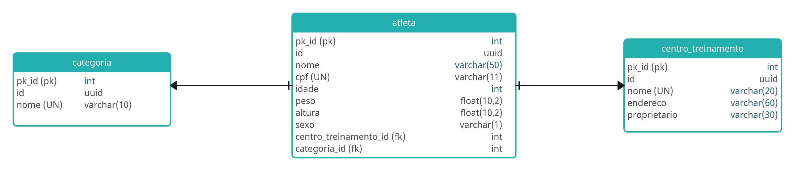

# API para cadastro de alunos no CrossFIt desafio DIO

# Projeto

Esta é uma API de competição de crossfit chamada WorkoutAPI. É uma API pequena, devido a ser um projeto mais hands-on e simplificado nós desenvolveremos uma API de poucas tabelas, mas com o necessário para você aprender como utilizar o FastAPI.

## Stack da API
A API foi desenvolvida utilizando o fastapi (async), junto das seguintes libs: alembic, SQLAlchemy, pydantic. Para salvar os dados está sendo utilizando o postgres, por meio do docker.

## Quem é o FastAPi?
Framework FastAPI, alta performance, fácil de aprender, fácil de codar, pronto para produção. FastAPI é um moderno e rápido (alta performance) framework web para construção de APIs com Python 3.6 ou superior, baseado nos type hints padrões do Python.

## Async
Código assíncrono apenas significa que a linguagem tem um jeito de dizer para o computador / programa que em certo ponto, ele terá que esperar por algo para finalizar em outro lugar

## Modelagem de entidade e relacionamento - MER


## Executando a API
Para esse projeto eu usei basicamente o poetry.

Para instalar o poetry na sua maquina:
```bash
pipx install poetry
``` 
Clonar esse repositorio:
```bash
git clone https://github.com/EricPettersonL/API_DIO.git
```


Para iniciar o projeto:
```bash
poetry install
```
Entrar no ambiente virtual:
```bash
poetry shell
```
Subir o banco de dados, instalar o [docker-compose](https://docs.docker.com/compose/install/linux/), depois execute:
```bash
task docker
```
Para subir a API:

```bash
task run
```
e acesse: http://127.0.0.1:8000/docs

